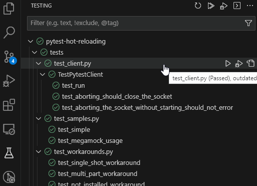
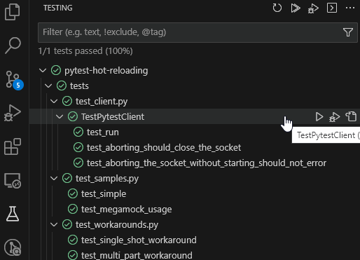
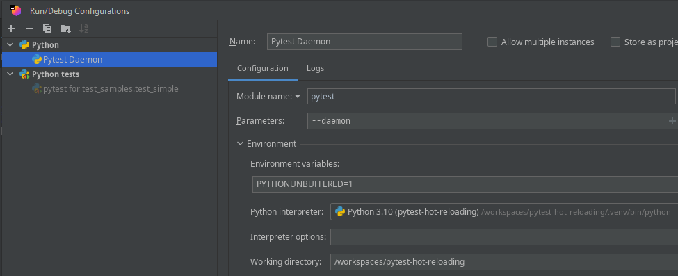
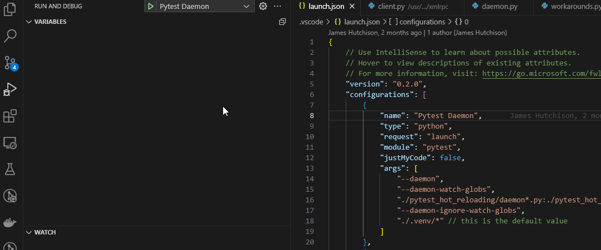

# A PyTest Hot Reloading Plugin


A hot reloading pytest daemon, implemented as a plugin.

## Features
- Uses the [jurigged](https://github.com/breuleux/jurigged) library to watch and hot reload files
- Caches test discovery in many situations
- Improved performance by not having to import libraries again and again and skipping initialization logic
- System for registering workarounds in case something doesn't work out of the box

## Trade-offs
- First run is slower
- May not work with some libraries
- Sometimes gets in a bad state and needs to be restarted

If it takes less than 5 seconds to do all of the imports
necessary to run a unit test, then you probably don't need this.

If you're using Django, recommended to use `--keep-db` to preserve the test database.

The minimum Python version is 3.10

## Demo

### With hot reloading
Slower initial start time but faster subsequent runs



### Without hot reloading


## Installation
Do not install in production code. This is exclusively for the developer environment.

**pip**: Add `pytest-hot-reloading` to your `dev-requirements.txt` file and `pip install -r dev-requirements.txt`

**poetry**: `poetry add --group=dev pytest-hot-reloading`


## Usage
Add the plugin to the pytest arguments.

Example using pyproject.toml:
```toml
[tool.pytest.ini_options]
addopts = "-p pytest_hot_reloading.plugin"
```

When running pytest, the plugin will detect whether the daemon is running.
If the daemon is not running, it will error unless the `--daemon-start-if-needed` argument is passed.

The current version of the VS Code Python extension is not, by default, compatible with automatically starting the daemon. The
test runner will hang. However, you can revert to legacy behavior which will allow for using the automatic starting. 
See the VS Code section below for more information.

Note that a pid file is created to track the pid.

Imports and in many cases initialization logic are not reran on subsequent runs, which can be a huge time saver.

Currently, if you want to debug, you will want to run the daemon manually with debugging.

### JetBrains (IDEA, PyCharm, etc)

Create a REGULAR Python run configuration, with pytest as the *module*. For parameters, add `--daemon`. Strongly consider storing
in the project so it is shared with other developers. Note that you most likely also need to set the working directory to the
project root where the pytest configuration is located so that it knows to use the plugin you configured earlier.



For more information on parameters, see the VS Code section below.

### VS Code



This can easily be done in VS Code with the following launch profile:

```json
        {
            "name": "Pytest Daemon",
            "type": "python",
            "request": "launch",
            "module": "pytest",
            "justMyCode": false,
            "args": [
                "--daemon",
                //
                // everything below this is optional
                //
                "--daemon-port",
                "4852", // the default value
                "--daemon-watch-globs",
                "./*.py" // the default value
                // "./my-project/*.py:./some-thing-else/*.py",  // example of colon separated globs
                "--daemon-ignore-watch-globs",
                "./.venv/*" // this is the default value, also colon separated globs
            ]
        },
```

The only reason you would need to limit the watched files is because the jurigged library
opens every file it watches, so it can exhaust the open file limit if you have a lot of files.

If the daemon is already running and you run pytest with `--daemon`, then the old one will be stopped
and a new one will be started. Note that `pytest --daemon` is NOT how you run tests. It is only used to start
the daemon.

The daemon can be stopped with `pytest --stop-daemon`. This can be used if it gets into a bad state.

To enable automatically starting the server, you have to, currently, disable the new Python Test Adapter:

In your devcontainer.json or user settings:
```json
"python.experiments.optOutFrom": [
    "pythonTestAdapter"
],
```

Then enable automatically starting the daemon in your settings:
```json
"python.testing.pytestArgs": [
    "--daemon-start-if-needed",
    "tests"
],
```

## Arguments and Env Variables
- `PYTEST_DAEMON_PORT`
    - The port the daemon listens on.
    - Default: `4852`.
    - Command line: `--daemon-port`
- `PYTEST_DAEMON_PYTEST_NAME`
    - The name of the pytest executable. Used for spawning the daemon.
    - Default: `pytest`.
    - Command line: `--pytest-name`
- `PYTEST_DAEMON_WATCH_GLOBS`
    - The colon separated globs to watch.
    - Default: `./**/*.py`.
    - Command line: `--daemon-watch-globs`
- `PYTEST_DAEMON_IGNORE_WATCH_GLOBS`
    - The colon separated globs to ignore.
    - Default: `./.venv/*`.
    - Command line: `--daemon-ignore-watch-globs`
- `PYTEST_DAEMON_START_IF_NEEDED`
    - Start the pytest daemon if it is not running.
    - Default: `False`
    - Command line: `--daemon-start-if-needed`

## Workarounds
Libraries that use mutated globals may need a workaround to work with this plugin. The preferred
route is to have the library update its code to not mutate globals in a test environment, or to
restore them after a test suite has ran. In some cases, that isn't possible, usually because
the person with the problem doesn't own the library and can't wait around for a fix.

To register a workaround, create a function that is decorated by the
`pytest_hot_reloading.workaround.register_workaround` decorator. It may optionally yield. If it does,
then code after the yield is executed after the test suite has ran.

Example:
```python
from pytest_hot_reloading.workaround import register_workaround

@register_workaround("my_library")
def my_library_workaround():
    import my_library

    yield

    my_library.some_global = BackToOriginalValue()
```

If you are a library author, you can disable any workarounds for your library by creating an empty
module `_clear_hot_reload_workarounds.py`. If this is successfully imported, then workarounds for
the given module will not be executed.

## Known Issues
- This is early alpha
- The jurigged library is not perfect and sometimes it gets in a bad state
- Some libraries were not written with hot reloading in mind, and will not work without some changes.

## Notes
- pytest-xdist will have its logic disabled, even if args are passed in to enable it
- pytest-django will not create test database suffixes for multiworker runs such as tox.
